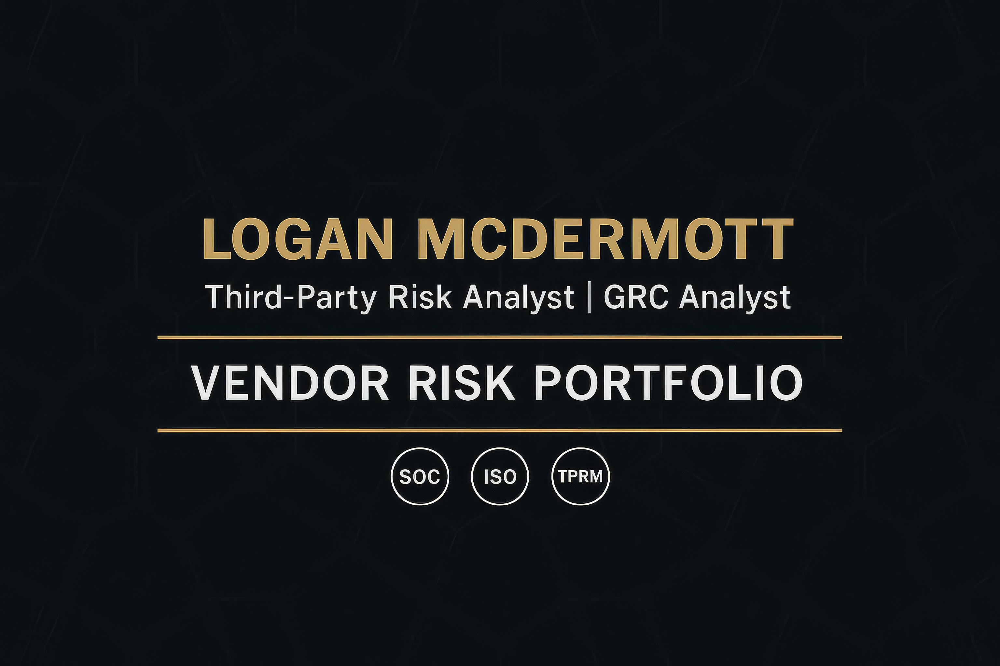

  

 

<h1 align="center">Logan McDermott</h1>

  <strong>Third-Party Risk Analyst • Vendor Security • GRC Analyst</strong>

  
  

---

## 👋 About Me

Vendor Risk Analyst specializing in SOC 2 reviews, vendor due diligence, and risk scoring.  
Focused on turning security evidence into clear decisions that help organizations onboard vendors safely and confidently.

---

## 📁 Featured Portfolio Projects

Your complete Vendor Risk portfolio showcasing real-world analysis, workflows, policies, and scoring models.

### **🔍 SOC 2 Analysis**
Full evaluation of a SOC 2 Type II report, including scope, controls tested, strengths, safe summaries of exceptions, and a risk conclusion.  
📄 [`SOC2_Analysis.pdf`](https://github.com/LoganMac8/vendor-risk-portfolio/blob/main/portfolio/SOC2_Analysis.pdf)

### **☁️ Cloudflare Vendor Assessment**
End-to-end vendor assessment including questionnaire responses, risk scoring, and approval recommendation.  
📄 [`Cloudflare_Assessment.pdf`](https://github.com/LoganMac8/vendor-risk-portfolio/blob/main/portfolio/Cloudflare_Assessment.pdf)

### **📘 Vendor Policy Suite**
Corporate-style policy set covering vendor security, TPRM, data handling, and access control.  
📄 [`Policy_Suite.pdf`](https://github.com/LoganMac8/vendor-risk-portfolio/blob/main/portfolio/Policy_Suite.pdf)

### **📊 TPRM Methodology & Workflow**
Documented risk scoring model, vendor tiering, due diligence expectations, and a structured workflow for security reviews.  
📄 [`Methodology.pdf`](https://github.com/LoganMac8/vendor-risk-portfolio/blob/main/portfolio/Methodology.pdf)  
📄 [`Workflow.pdf`](https://github.com/LoganMac8/vendor-risk-portfolio/blob/main/portfolio/Workflow.pdf)

---

## 🧠 Skills & Focus Areas

### **Vendor Risk / GRC**
- SOC 2 Type I & II  
- Vendor due diligence  
- Risk scoring & heatmaps  
- Evidence review  
- Third-party security requirements  
- Continuous monitoring  

### **Security Concepts**
- MFA & access controls  
- Logging & monitoring fundamentals  
- Encryption basics  
- Cloud shared responsibility  
- Vulnerability & patch management  
- Incident response fundamentals  

### **Professional Strengths**
- Clear written communication  
- Analytical & detail-oriented  
- Structured documentation  
- Reliable, process-driven work  
- Fast learner, fast execution  

---

## 📚 Currently Learning
- Supply chain security frameworks  
- ISO 27001 Annex A mappings  
- Cloud security fundamentals (AWS, SaaS)  
- Audit & assurance best practices  

---

## 📫 Connect With Me

- **LinkedIn:** https://www.linkedin.com/in/logan-mcdermott-487710221/  
- **Portfolio Repository:** https://github.com/LoganMac8/vendor-risk-portfolio

---

<i>Thanks for visiting my profile!</i>

